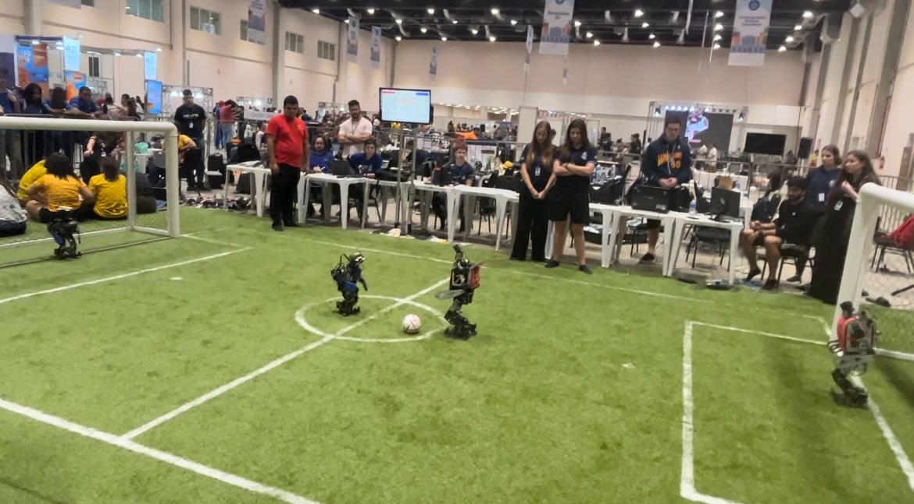

# 🤖 Using convolutional neural networks for recognition and localization of visual landmarks for a humanoid robot
---
## Description
This repository presents the Undergraduate Scientific Research project developed to enhance the localization and decision-making capabilities of the humanoid robot from the RoboFEI team, which participates in humanoid robot soccer games. To improve the robot's efficiency in locating itself on the soccer field, an algorithm was implemented to detect landmarks on the field, as well as to measure the distance between the robot and the identified elements.
The project involved the study and application of computer vision and image recognition techniques, such as Convolutional Neural Networks. The results achieved confirm the effectiveness of the algorithm, demonstrating that the detection of landmarks and distance calculation were carried out with good precision.

<p align="center">
  
</p>

---
## Objectives
The principal objectives of this project are to enhance the localization capabilities of a humanoid robot by implementing an algorithm for accurate landmark detection on the soccer field, to improve the robot's decision-making by enabling strategic actions based on its position and proximity to landmarks, and to ensure robust performance across various lighting conditions. Additionally, the project aims to lay a foundation for future developments by providing a reliable base for further enhancements in the robot's capabilities.

---
## Prerequisites
- Linux (Ubuntu 20.04 or later - recommended for compatibility with ROS2)
- Git
- Python
- ROS2
- YOLOv7

---
## Installation and usage
To run this project locally, follow these steps:
1. Clone the repository:
```sh 
git clone https://github.com/massiblandy/Iniciacao_Cientifica.git
```
2. Install ROS2 Humble Hawksbill by following the official [ROS2 installation guide](https://docs.ros.org/en/humble/Installation.html) and all the libraries that are used in this code.
3. Compile all the packages, in the source folder:
```sh 
colcon build --symlink-install
```
4. Setup the environment:
```sh 
source install/setup.bash
```
5. Run the different codes:
    - Control: 
        ```sh 
        ros2 launch control action.launch.py
        ```
    - Motors:
        ```sh 
        ros2 run dynamixel_sdk_examples read_write_node
        ```  
    - Landmarks detection code:
        ```sh 
        ros2 run vision_yolov7 detect
        ```
    - To run a specific movement of the robot (in this project was just used the stand still movement):
        ```sh 
        ros2 action send_goal  /control_action custom_interfaces/action/Control "{action_number: 1}"
        ```
6. Make sure to also install any required dependencies as needed.
7. Visualize the detected landmarks:
    - The node will display a real-time video feed with the detected landmarks and bounding boxes drawn on the video stream.
    - The distance calculations will be logged in the console.

---
## Results
The results of this project demonstrated that the implemented algorithm was successful in detecting the visual landmarks on the soccer field and accurately calculating the distance between the robot and these landmarks. The system showed robustness in different lighting conditions and varying perspectives, contributing to improved localization and decision-making by the humanoid robot.

---
## Acknowledgements
This project was developed as part of an Undergraduate Scientific Research program at Centro Universitário FEI. Special thanks to the RoboFEI team for their support and collaboration throughout the project.

---
The Scientific Research is oriented by the professor [@Reinaldo Bianchi](https://www.linkedin.com/in/reinaldo-bianchi-b343468/).

Massiel Blandy Ramón - [Linkedin](https://www.linkedin.com/in/massiel-blandy-ram%C3%B3n-65214829a/) - massi00br@gmail.com

[https://github.com/massiblandy](https://github.com/massiblandy)
